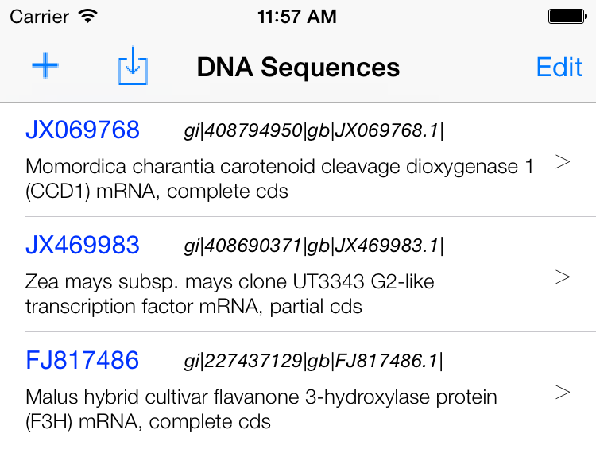

# A Bioinformatics App on iPhone 

## Introduction
The App demostrates a few of basic functions and algorthms for Bioinformatics.
* Manage Nucleotides sequences. Use may download them from GenBank by accession numbers
* Translate DNA sequences to RAN/protein
* k-mer generating/couting/charting
* Local/global alignment for protein strings

## Development Environment
* Xcode 6.3 / Swift 1.2
* iOS 8 

## Usage

### Data management

A table view of the App shows the list of DNA sequences. A few samples are provided for the first time user. The table shows the *accession number*, *version* and *description* of the sequence. Further information can be found [here](http://www.ncbi.nlm.nih.gov/Sitemap/samplerecord.html).

[[screenshot/screen_dna_seq.png|width=100px]]

The **Edit** button on the up right is used to delete recrods, which is persistent on the disk. 

The **New** button on the up left creates a new record and takes user to the *details* view. When finishing editing, use the save button on the up-right to save the change.

User may editing exising record by select a row, it takes user to the same view as the *new* function.

Creating a record mannually is tedious, the **Download** button right next to *New* let user to download a record from GenBank. Just input the **accession number** and click **Download**. The function is implemented using NCBI [Entrez Programming Utilities](http://www.ncbi.nlm.nih.gov/books/NBK25501/) webservices. 

### Translating DNA to RNA/Proten
The **RNA** and **Protein** buttons on the buttom tool bar of *Details* view let user to translating the DNA sequences to RNA and Proten. The results are shown in ??

### k-mer functions
The **k-mer** button takes user to k-mer related function as shown ??. 

It is a tab bar view. The setting tab let user change the k-mer size. The default size is 4. When click *Calculate*, the underlying k-mer data is regenerated. 

The **k-mer Freq** tab shows the table of ordered frequencies.

The **Profile** tab shows the counting frequencies.

Finally the **Chart** tab shows the histogram chart for the counting frequencies.

### Alignment
The **Align** button take to the alignment setting view. User needs to choose another sequence to align with. When **Select**, a picker view lets user to make the selection. 

User may also:
- choose a score matrix between **BLOSUM62** and **PAM250**
- choose **Global** or **Local** alignment
- change the gap penalty. Note that the penalty can not be negative.

Finishing all the choices, **Go** button shows the alignment result in a table view. The aligned sequences are divided into lines to make it easy to read.

## Project Reference
The App applies [ios-charts](https://github.com/danielgindi/ios-charts) to draw histogram chart for k-mer profiles.

The App uses NCBI [Entrez Programming Utilities](http://www.ncbi.nlm.nih.gov/books/NBK25501/) webservices to download data from GenBank

## Reference
1. Bioinformatics: [https://en.wikipedia.org/wiki/Bioinformatics](https://en.wikipedia.org/wiki/Bioinformatics)
2. GenBank: [http://www.ncbi.nlm.nih.gov/genbank/](http://www.ncbi.nlm.nih.gov/genbank/)
3. FASTA format: [https://en.wikipedia.org/wiki/FASTA_format](https://en.wikipedia.org/wiki/FASTA_format)
4. K-mer: [https://en.wikipedia.org/wiki/K-mer](https://en.wikipedia.org/wiki/K-mer)
5. Sequence alignment: [https://en.wikipedia.org/wiki/Sequence_alignment](https://en.wikipedia.org/wiki/K-mer)
6.  David Mark , Jack Nutting , Kim Topley , Fredrik Olsson , Jeff LaMarche. *Beginning iPhone Development with Swift: Exploring the iOS SDK(2014)*. ISBN13: 978-1-484204-10-8

